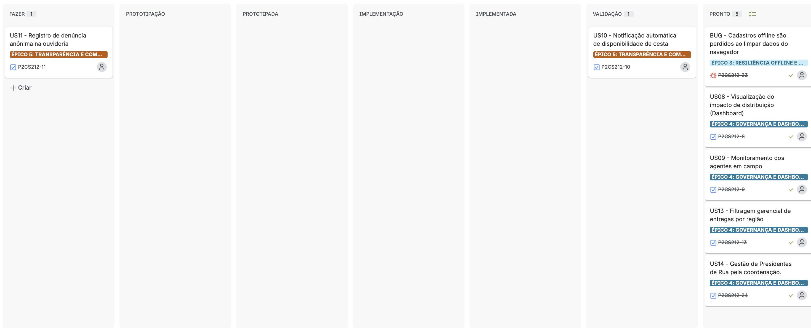
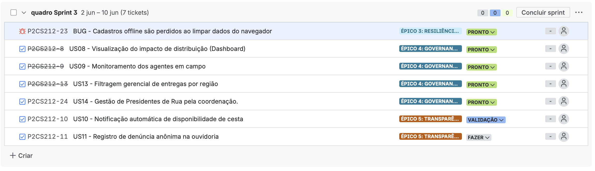

# PILAR — Sistema para o Presidente de Rua

Plataforma de apoio à distribuição de cestas básicas em comunidades, construída
para o fluxo do **Presidente de Rua** (G10 Favelas). O sistema organiza o
cadastro de famílias em áreas sem CEP oficial, prioriza quem está há mais tempo
sem receber, registra entregas e dá transparência ao morador — funcionando até
**offline**, já que a operação acontece em campo, muitas vezes sem sinal.

---

## Funcionalidades principais

### 👷 Presidente de Rua (operação em campo)

- **Cadastro de famílias** mesmo sem CEP oficial, usando o "Código da Viela".
- **Prevenção de duplicidade**: bloqueia cadastro de mesma família (nome + viela).
- **Fila de prioridade** ordenada automaticamente por tempo de espera.
- **Registro rápido de entrega** de cesta, atualizando a fila na hora.
- **Histórico de entregas** por família.
- **Filtros operacionais** por status de recebimento e tempo de espera.
- **Modo offline**: cadastros são salvos no dispositivo e **sincronizados**
  quando a internet volta, com **backup/restore** em arquivo.
- **Suporte via WhatsApp** com um toque.

### 🛡️ Administrador (governança)

- **Dashboard de impacto** (total de cestas entregues).
- **Entregas por região** com filtro gerencial.
- **Gestão de regiões** e de **Presidentes de Rua** (cadastro/edição/status).
- **Monitoramento de agentes** em campo (famílias atendidas, frequência).
- **Disparo de avisos** de cesta disponível (mensagem pronta para WhatsApp).
- Acesso protegido por **autenticação por token** (somente staff).

### 🏠 Morador (transparência)

- **Identificação pelo próprio cadastro** (nome + código da viela).
- **Histórico de cestas** recebidas e **notificações** de disponibilidade.
- **Ouvidoria anônima**: denúncia sem login, com protocolo de acompanhamento e
  proteção **anti-spam** (rate limit por IP).

---

## Tecnologias

| Camada | Stack |
|--------|-------|
| **Backend** | Python 3.13, Django 6, Gunicorn, WhiteNoise |
| **Banco** | PostgreSQL (produção) · SQLite (desenvolvimento) |
| **Frontend** | React 19, TypeScript, Vite |
| **Testes** | Django `TestCase` (backend) · Vitest + jsdom (frontend) |
| **Deploy** | Render (API) · Vercel (SPA) |

---

## API

O sistema **expõe a própria API REST** (Django), consumida pela SPA em React.
**Não há consumo de API externa de terceiros** — o contato por WhatsApp usa
apenas *deep links* `wa.me` (sem chave de API).

Principais endpoints internos:

| Método | Rota | Descrição |
|--------|------|-----------|
| `POST` | `/api/auth/login/` | Login (retorna token de admin) |
| `GET/POST` | `/api/families/` | Lista / cadastra famílias |
| `GET` | `/api/families/lookup/` | Morador localiza o próprio cadastro |
| `POST` | `/api/families/<id>/deliveries/` | Registra entrega |
| `GET/POST` | `/api/regions/` | Regiões |
| `GET/POST` | `/api/field-agents/` | Presidentes de Rua |
| `GET` | `/api/dashboard/impact/` · `/api/dashboard/regions/` | Indicadores |
| `POST` | `/api/anonymous-complaints/` | Ouvidoria anônima |
| `GET/POST` | `/api/basket-availability-notifications/` | Avisos de cesta |

---

## Como rodar localmente

### Backend (Django)

**macOS / Linux:**

```bash
cd src
python3 -m venv .venv && source .venv/bin/activate
pip install -r ../requirements.txt
python manage.py migrate
python manage.py runserver   # http://127.0.0.1:8000
```

**Windows (PowerShell):**

```powershell
cd src
python -m venv .venv; .venv\Scripts\Activate.ps1
pip install -r ..\requirements.txt
python manage.py migrate
python manage.py runserver   # http://127.0.0.1:8000
```

> No Windows, se o PowerShell bloquear a ativação do venv, rode uma vez:
> `Set-ExecutionPolicy -Scope CurrentUser RemoteSigned`.

### Frontend (React + Vite)

```bash
cd frontend
npm install
npm run dev                  # http://localhost:5173
```

Variáveis de ambiente do frontend (opcionais — têm padrão):

| Variável | Padrão | Uso |
|----------|--------|-----|
| `VITE_API_BASE_URL` | `http://127.0.0.1:8000` | URL da API |
| `VITE_SUPPORT_WHATSAPP_NUMBER` | *(vazio)* | Número de suporte |

### Usuário padrão para testes

Para acessar o painel de **Administrador**, crie o usuário staff:

**macOS / Linux:**

```bash
cd src
DJANGO_SUPERUSER_USERNAME=admin \
DJANGO_SUPERUSER_EMAIL=admin@exemplo.com \
DJANGO_SUPERUSER_PASSWORD=admin123 \
python manage.py create_admin_user
```

**Windows (PowerShell):**

```powershell
cd src
$env:DJANGO_SUPERUSER_USERNAME="admin"
$env:DJANGO_SUPERUSER_EMAIL="admin@exemplo.com"
$env:DJANGO_SUPERUSER_PASSWORD="admin123"
python manage.py create_admin_user
```

| Campo | Valor |
|-------|-------|
| **Usuário** | `admin` |
| **Senha** | `admin123` |

> ⚠️ Credenciais apenas para **ambiente de testes/avaliação**. Em produção, use
> uma senha forte definida por variável de ambiente.

---

## Links do projeto

| Recurso | Link |
|---------|------|
| 🌐 **Google Site** | [Acessar](https://sites.google.com/d/1K02Hrw1STtLezyLiWoKHnTY4T30FAAjo/p/1mZhvYlT0TZYnwLNyzLGIB6OC51nWcoOn/edit?pli=1) |
| 🎬 **Screencast** — demonstração das histórias implementadas | [Assistir](https://youtu.be/JBuNqv0ek4k) |
|🎬 **Screencast dos testes** — demonstração das histórias implementadas | [Assistir](https://youtu.be/JBuNqv0ek4k) |
| 🎨 **Protótipo Lo-fi / Sketches (Figma)** | [Abrir](https://www.figma.com/make/OLxWYt3DGh4MAeKJfjIJqW/Sistema-de-Cadastro-Familiar?p=f&t=bo1uluQfLFscRidW-0&preview-route=%2Fcomplaints) |
| 📄 **Relatório programação em par** | [Acessar](https://docs.google.com/document/d/1CGdkkM_KJb4NJE_wdBCkO6A7CC9Yr_HkX7Qvm2_AMs0/edit?tab=t.0) |

---

## Gestão do Projeto

Acompanhamento de tarefas e sprints no **Jira**. A sprint atual **não foi
concluída** — parte das histórias ficou pendente e os bugs encontrados estão
registrados no bug tracker.

**Board / Sprint (Jira):**



**Bug tracker:**



---

# Histórias de Usuário

---

## Persona: Presidente de Rua

### Cenário 1 - Cadastro de família em área sem CEP oficial

**Dado** que o Presidente de Rua acessa o formulário de nova família,  
**Quando** ele preenche os dados usando apenas o "Código da Viela" e deixa o campo CEP em branco,  
**Então** o sistema deve validar o cadastro normalmente,  
**E** deve exibir uma mensagem de "Família mapeada com sucesso".

### Cenário 2 - Prevenção de cadastro duplicado

**Dado** que o Presidente de Rua preenche o formulário com dados muito similares a alguém já existente (ex: mesmo nome e viela),  
**Quando** ele finaliza o cadastro clicando em salvar,  
**Então** o sistema deve interromper a ação automaticamente,  
**E** deve exibir um alerta informando "Atenção: Possível duplicidade de morador encontrada".

### Cenário 3 - Consulta de histórico de entregas

**Dado** que o Presidente de Rua acessa o perfil de uma família cadastrada,  
**Quando** ele clica na aba de histórico,  
**Então** o sistema deve exibir a lista completa de datas em que a família recebeu cestas,  
**E** o Presidente de Rua poderá avaliar se a doação é justa.

### Cenário 4 - Ordenação da fila de prioridades por urgência

**Dado** que o Presidente de Rua acessa a tela de fila de prioridade,  
**Quando** o sistema carrega a lista de famílias cadastradas naquela região,  
**Então** a lista deve ser ordenada automaticamente pelo sistema,  
**E** as famílias com maior número de dias sem receber devem aparecer no topo da tela.

### Cenário 5 - Registro rápido de entrega de cesta básica

**Dado** que o Presidente de Rua está visualizando a fila de prioridades,  
**Quando** ele clica no botão "Confirmar Entrega" ao lado do nome do morador,  
**Então** o sistema deve atualizar a data de recebimento da família para o dia atual no banco de dados,  
**E** o morador deve sumir da lista de urgências.

### Cenário 6 - Salvamento de dados sem conexão de internet (Modo Offline)

**Dado** que o Presidente de Rua perdeu o sinal de internet (4G) durante a rota,  
**Quando** ele realiza e salva o cadastro de uma família no aplicativo,  
**Então** o sistema deve armazenar os dados temporariamente no cache do celular,  
**E** deve exibir uma mensagem informando que "Os dados serão sincronizados quando a internet voltar".

### Cenário 7 - Acesso rápido ao suporte operacional

**Dado** que o Presidente de Rua está com uma dúvida urgente durante a entrega,  
**Quando** ele clica no botão de "Ajuda" no aplicativo,  
**Então** o sistema deve redirecioná-lo automaticamente para o WhatsApp,  
**E** deve abrir uma conversa direta com o número oficial de suporte do G10 Favelas.

### Cenário 12 - Filtragem operacional do status de recebimento na rua

**Dado** que o Presidente de Rua possui uma lista extensa de famílias no aplicativo,  
**Quando** ele seleciona o filtro "Já Receberam",  
**Então** o sistema deve ocultar as famílias que ainda precisam de cesta,  
**E** deve exibir apenas os moradores que já retiraram a doação naquela semana.

---

## Persona: Administrador (Governança)

### Cenário 8 - Visualização do impacto de distribuição

**Dado** que o Administrador acessa o painel de controle do sistema,  
**Quando** a página principal (Dashboard) é carregada,  
**Então** o sistema deve calcular automaticamente as doações do banco de dados,  
**E** deve exibir o número total de cestas distribuídas naquele mês.

### Cenário 9 - Monitoramento dos agentes em campo

**Dado** que o Administrador acessa a aba de "Agentes",  
**Quando** ele seleciona o perfil de um Presidente de Rua,  
**Então** o sistema deve exibir a região de cobertura desse agente,  
**E** a quantidade de entregas que ele realizou no período.

### Cenário 13 - Filtragem gerencial de entregas por região

**Dado** que o Administrador está no painel de controle,  
**Quando** ele seleciona uma comunidade específica no filtro de regiões,  
**Então** o sistema deve recalcular os dados exibidos,  
**E** deve mostrar apenas o histórico e o volume de cestas entregues naquela localidade escolhida.

### Cenário 14 - Gestão de Presidentes de Rua

**Dado** que o Administrador acessa a área de gestão de Presidentes de Rua,  
**Quando** ele cadastra, edita ou desativa um Presidente de Rua,  
**Então** o sistema deve registrar a alteração no banco de dados,  
**E** apenas os Presidentes ativos devem permanecer vinculados às operações em campo.

---

## Persona: Morador (Transparência)

### Cenário 10 - Notificação automática de disponibilidade de cesta

**Dado** que o sistema identificou que chegou o dia da entrega na região da família,  
**Quando** o Presidente de Rua ou Administrador libera o lote de cestas no sistema,  
**Então** o sistema deve disparar um aviso automático (via SMS/WhatsApp) para o morador,  
**E** deve informar a data, horário e o local exato da retirada.

### Cenário 11 - Registro de denúncia anônima na ouvidoria

**Dado** que o morador acessa o link de denúncias do sistema sem realizar login,  
**Quando** ele preenche a reclamação e clica em enviar,  
**Então** o sistema deve salvar a denúncia no banco de dados sem atrelar nenhum IP ou nome,  
**E** deve exibir a mensagem "Denúncia enviada com sucesso e total sigilo".
